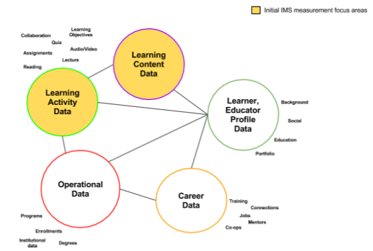
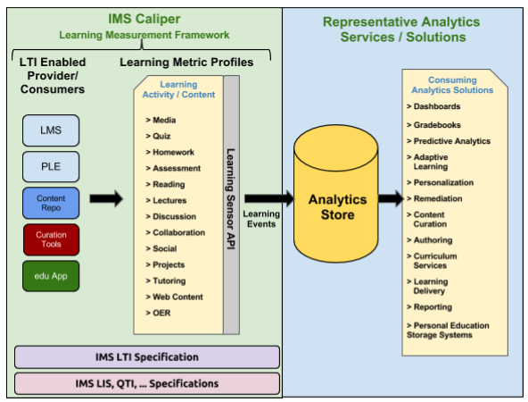
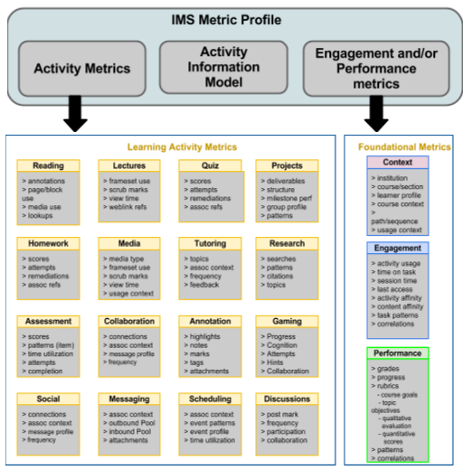
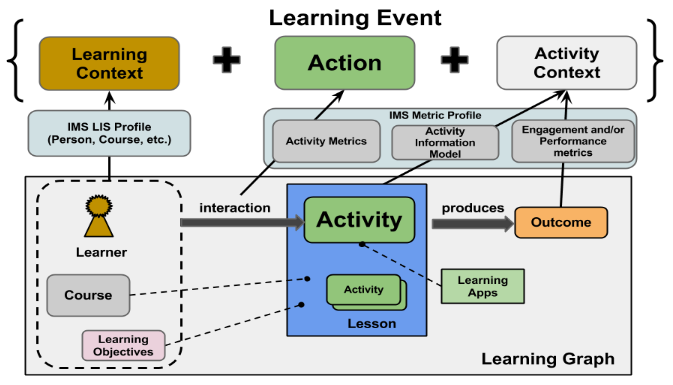
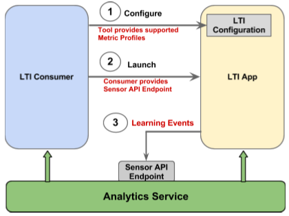
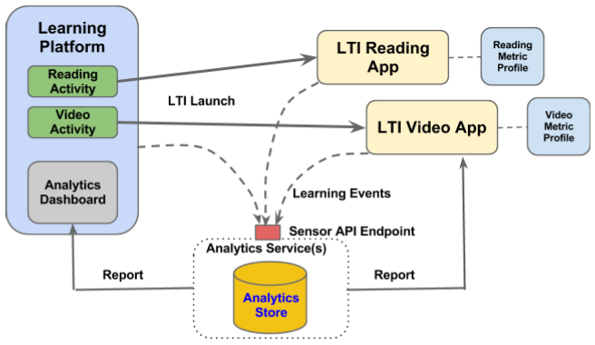

# アナリティクス用学習測定に関するホワイトペーパー

> この文書は、[IMS Global Learning Consortium](http://www.imsglobal.org/) による [「Learning Measurement for Analytics Whitepaper」](http://www.imsglobal.org/IMSLearningAnalyticsWP.pdf) の有志による日本語訳です。
>
> 本書は、IMS が策定を進めるオンライン学習測定フレームワーク Caliper の概要を紹介したものです。
>
> - 本書の現著作権は IMS Global Learning Consortium に帰属します。  
>    ©2013 IMS Global Learning Consortium, Inc. All Rights Reserved
> - この翻訳は参考であり、公式のものではありません。
> - 翻訳に関する誤りの報告や改善の提案には、Github の Issue または Pull Request をご利用ください。
>
> <dl>
> <dt>翻訳</dt>
> <dd>日本電子出版協会（JEPA）／高瀬拓史（イースト株式会社）</dd>
> <dt>公開</dt>
> <dd>2014-06-30</dd>
> <dt>更新</dt>
> <dd>2014-11-07</dd>
> </dl>

## 機会

オンライン教育の状況は、オンラインデジタルカリキュラムの開発・配信・加入において大幅な成長を続けている。また、豊富なオンライン学習活動を測定・分析できるアカウンタビリティは、これまでも大きな関心を集めてきたものであり、今必要とされているものでもある。この関心は、高度にスケール化されたオンラインカリキュラムを配信する MOOCS をはじめとするオンラインプログラムが近年急増していることと相まって、より効率的で詳細なオンライン学習環境のために、教育に「ビッグデータ」解析を取り入れようとする動きを教育テクノロジー（edtech）のエコシステムの中に引き起こしている。測定可能性に裏付けられたアカウンタビリティへの関心と需要は、IMSとその標準規格がリーダーシップをとって、学習活動とそのパフォーマンスを極めて細かいレベルで測定可能にする共通基盤を定義する絶好の機会である。

学習測定のために標準ベースの共通基盤を用意すれば、エコシステム全体のオンラインカリキュラムを分析することで、品質や有効性やパフォーマンスをより効果的なものにできる。このオンラインカリキュラムの生産者（すなわち機関、講師、カリキュラム開発者、学習デザイナー等）と消費者（すなわち学習者／生徒）の両者は、より良いかたちで参加、測定、復習を繰り返し、カリキュラムと学習体験の成果を継続的に改善できる。加えて、機関や教育テクノロジーのプロバイダーは、高い需要と価値を持つ、新しい強力なデータ駆動型拡張機能（学習分析、予測分析／パス管理、適応学習、パーソナライゼーション、早期警告、バッジや認定の授与などが挙げられる）を、オンライン学習配信プラットフォームに届けることができる。
このタイムリーで価値ある機会を踏まえて、標準ベースの学習測定フレームワークを実現するための戦略と方針に優先的に取り入れた課題には、主に次のものがある。

- 現在のオンラインカリキュラム配信は非標準的であり、幅広いソリューションやプロバイダーが提供する教育アプリケーションは、そのカリキュラム学習活動の内容と機能を評価するメトリックスがまったく存在していない状況にある。こうした多様なソリューションは、それぞれのプロバイダーの配信プラットフォーム／アプリケーションの中で、高度に連合し、断片化され、「サイロ化」されている。このようなソリューションの集合が、オンラインの授業やカリキュラムの中でしばしば共存している。中には標準化されたメトリックス（例えば [Bloom’s Taxonomy](http://en.wikipedia.org/wiki/Bloom's_Taxonomy)、 [Common Core](http://www.corestandards.org/the-standards)、 [Predictive Analytics Reporting (PAR) フレームワーク](https://public.datacookbook.com/public/institutions/par), [Council for the Advancement of Standards in Higher Education -Learning and Developmental Outcomes](http://www.cas.edu/index.php/cas-general-standards/)) に関連した学習の設計／パフォーマンス目標を達成するべく改善を進める動きもあるが、より普遍的で幅広測定のコンテキストの中で使えるものでなければならない。

- こうした状況を考慮すると、カリキュラムの中やカリキュラム同士の間で測定された学習活動に対して、配信コンテキストを踏まえることなく、統一的かつ一貫した見方を確立するのは難しい。
- 標準化された一貫性のある計測フレームワークとメトリックスがなければ、学習活動を効果的に比較したり互いに関連付けたりすることも、カリキュラムの効果を判断することも、学習者同士の相互作用やパフォーマンスへの潜在的影響を評価することも難しい。
- かなり以前から存在する取り組み（すなわち Learning Tools Interoperability™(LTI)™, Learning Information Services (LIS), Question and Test Interoperability™(QTI)™）は、学習活動のカプセル化と活用可能なコンテキストを標準化するために行われた。しかしこれらは、学習測定を行うために拡張する必要がある。
- ビッグデータテクノロジーやデータサイエンスの取り組みといった新しく広範な分野から生まれた規約や標準の多くは、互いに重複したり不足したりしている。これらの技術や取り組みには、NoSQL、クラウドスケールの関係データベース、グラフデータベース、Map-Reduce、ADL Experience/TinCan APIなどがあるが、早期の段階にあったり、オンライン教育に最適化した測定や分析の標準化に利用できるのか不明であったりする。

こうした機会と課題を踏まえると、習測定を目的とした教育用アプリケーション向けモデルの選択要素として、近年登場した基盤的なデータサイエンスの方法や標準や技術を理解し取り入れてゆくことが重要となる。これは単に効率を高めるばかりでなく、垂直方向への標準化を可能な限り促進し、垂直的に適用可能な教育ソリューションの設計、実装、拡大を進めうる。

さらに、測定とデータに結びついた教育の「Edu Graph」（図1）は、（最近登場したソーシャルデータによる「ソーシャルグラフ」に似ているが）、さまざまな専門分野のコンテキストに渡ってその広さと深さを拡大できるという認識が重要だ。こうした専門分野の情報は、エコシステムや教育のワークフローの中にある、管理／業務、カリキュラムの活動とコンテンツ、共同カリキュラム、学習者／教育者のプロフィールや経歴といった情報源によってコンテキスト化されている。

**図1：「Edu Graph」の包括的なデータモデル**

*こうして改良された学習測定の影響と価値を実現するためには、まずは、Edu Graph の小さなサブセットに注力することが重要だ。これに並行して、標準化されたソフトウェアサービスのフレームワークの確立も、長い時間をかけて行い、増加してゆく Edu Graph のさまざまなファセットをカバーするために、容易に対応や拡張できるようにする。*

このホワイトペーパーにおける提案は、広範な Edu Graph の中の「学習グラフ」のファセットを目標としている。それは、重要カリキュラムに関する学習活動とそれに関連した有効性と達成度の測定に、意図的に焦点を当てている。はじめに学習グラフを対象とした根拠はシンプルだ。それは実際の学習コンテキストに焦点を当てるためである。学習コンテキストこそが教育ワークフロー全体の中心であり、そこから生まれる他のコンテキストがさらに深い洞察や価値を加えてゆくからだ。

## 戦略的方針

このホワイトペーパーが示す戦略は、IMSによる既存の仕様とこれから加わることになる仕様を利用した学習測定と分析のサポートによって、学習システムが学習の相互作用に関わるデータをどのように取得して共有するべきなのか、という高レベルの勧告を述べるものである。

*この戦略は、より総合的なソリューションの学習分析ドメインを実現する、標準的な測定フレームワークを通じて、秩序をもたらすことを初期の優先事項としている点に注意して欲しい。*

IMSとその標準はまず、関連するデータの提示や取得や整備を安定して行う強固な基盤の確立に役割を果たす必要がある。それが後になってエコシステム全体を大幅に改良しうる高次の解析ソリューションの土台となるはずだ。

この目標を前にすすめるために、IMSでは会員機関や供給業者と協力して、**Caliper** という学習測定フレームワークを定義する予定だ。このフレームワークを図2に示す。

*図2における Caliper のスコープは左側の緑色の矩形として示される。*

**図2：IMS Caliper - 学習測定フレームワーク**

IMS Caliper は、次のコンセプトを中心に設計されている。

- **IMS Learning Metric Profile** は（行動とそれに関連したコンテキストの）メトリックスに沿った学習活動中心のフォーカスを提供する。このメトリックスは、消費者と生産者がカリキュラムに基づいて活動の利用や編成を行う学習ツールの配信活動や学習プラットフォームにわたって取得される。また独自の拡張や機能をプロファイルに追加できるようにもする。
- **IMS Learning Sensor API** と Learning Event は標準化された計測とメトリックスの取得を行い、ツールやその配信プラットフォームや、関連したメトリックスを収集する解析サービスソリューションを整理する。
- **IMS LTI™/LIS/QTI™ の利用と拡張** はツールの相互運用性と、講座、学習者、成果などの重要な関連コンテキストを含む基本的な学習情報モデルによって、細かく標準化された学習測定を強化統合する。以後のセクションではこれらのフレームワークの要素について、さらに詳細に述べる。

### IMS Learning Activity Metric Profile

一般的に学習カリキュラムは、ひとつ以上の学習活動の集合やシーケンスとして作成、配信される。ほとんどの学習活動は、ひとつの（複合的な活動の場合は、それ以上の）ジャンルにグループ分けされる。例えば、Reading、Assessment、Media、Collaborationなどのジャンルがある。これは学習活動のそれぞれのジャンルを、ベースラインの一貫したメトリックスから始まるように構成し最適化するのに役立つ。

IMS Learning Metric Profile は Learning Activity Metrics の標準化および構造化された集合の定義を目的としている。Learning Activity Metrics はそれぞれの **action** に固有の細かい **measurement** をあらわす。**activity** のそれぞれのジャンルは、activity へのあらゆるアクションに関連した **context**を持つ。さらに**engagement** や **performance**といった、ジャンルに依らない **Foundational Metrics** があり、あらゆる activity について、汎用的な評価基準による一般的な測定を行うことができる。あらゆる学習活動は（ひとつ以上の）Metric Profile を持つことができ、それによって取得と管理が必要なあらゆる measurement の収集と交換を行う。

IMSではもっとも一般的な学習活動のタイプのために、Learning Metric Profile の最初の集合を定義する作業を続けている。それは LTI™、LIS、QTI™といった既存の／策定中の／将来計画されているIMS標準のコンポーネントや拡張として使われるはずだ。これらのIMS標準では、メトリックスに対して取得するコンテキスト要素（情報モデル）を指定している。activity のメトリックと情報モデルの両者は Metric Profile を定義する。すなわち、ベースとなる「スキーマ」を提供して、標準ベースの measurement とシステム間での学習データの交換を可能にするのである。

図3はIMSが会員組織や供給業者と協力しながら開発しようとしている Metric Profile のタイプの（最終決定したものではない）サンプルを示している。

**図3: IMS Metric Profile のサンプル**

IMS Learning Analytics グループでは、メトリックスと、Edu Graph の多様な側面に求められる学習や発展の成果を定義するためのさまざまな組織による取り組みを、Caliper Metrics Profile に活用し取り入れてゆく予定だ。そこには次のものが含まれる（限定するものではない）。

- [Predictive Analytics Reporting (PAR) フレームワーク][PAR] のデータモデル：IMS Context and Engagement metrics の一部をなす
- [Common Core Standards][Common Core]：IMS Performance metricsの一部をなす
- [CAS standards for student developmental and learning outcomes for higher education][CAS standards]：IMS Performance metricsの一部をなす

[Common Core]: http://www.corestandards.org/the-standards

[PAR]: https://public.datacookbook.com/public/institutions/par

[CAS standards]: http://www.cas.edu/index.php/cas-general-standards/

### IMS Learning Sensor API と Learning Events

**IMS Sensor API ** は **Learning Activity Metric Profile** と密接に結びついており、学習ツール／システムや関連した学習コンテンツ要素から生まれたデータの計測、収集、交換をサポートする。これによって、どんなAnalytics Storeやその関連APIからも標準メトリックスにアクセスできるようになる。

その中核部分として、 **Sensor API** は学習活動の相互作用に基づいた Learning Event の交換をサポートする予定だ。図3が示すように、Learning Eventは **“LearningContext” -“Action” -“ActivityContext”** の三者からなるデータ形式として表現される。これは W3C RDF Triple における "subject/predicate/object" の形式をベースとしている。すなわち、ある目的語（主語）から別の目的語（目的語）やリテラルにリンクするのに述語を経由している。このケースでは Learning Event は Learning Activity とともに相互作用の測定を表現することができる。

Learning Event は **Sensor endpoint** によって利用される。これらのエンドポイントは Learning Event を利用しようとするどんなアプリケーションからも利用でき、HTTP/REST といった広く使われているプロトコルをサポートすることが期待されている。

**図4: IMS Sensor API -Learning Event**

これを可視化する方法としてまず **LearningContext** について述べる。一般に学習コンテキストとは教育と学習が生まれる環境のことだ。そこには講座、講師、生徒、学習プラットフォーム、プログラム、機関などが含まれる。

Learning **Activity** は LearningContext の教育と学習を促進するために導入される。これらの活動には一般に、読解、ビデオ、クイズ、ディスカッションなどが含まれる。通常これらの活動はグループ化され、所定の学習経路に順序づけられる。

最後に、教育と学習の過程において、LearningContext と Activity におけるエンティティ同士の相互作用がある。これを **Action** と呼ぶ。

これら三つのデータセットを組み合わせて **LearningEvent** とするのは、LearningContext における Activity を伴った相互作用を完全に記述するためだ。この三者の組み合わせに加えて、LearningEvent はタイムスタンプを持つ。

図4が示すように、Learning Event の三者の要素はそれぞれ、学習の相互作用において、ひとつ以上のエンティティを定義している。これらのエンティティは合わさって、学習環境の中のエンティティの繋がりをベースにした **Learning Graph** を作り上げる。それぞれの要素は既存のIMSの仕様と語彙をベースに記述することになるだろう。これは策定中の IMS Learning Activity Metric Profile でも同様である。

Learning Event と Metric Profile は完全にオープンなメカニズムと、学習グラフにおける学習の測定と分析のための厳格なスキーマとのバランスを取ることを意図している。Metric Profile は非常に軽量なスキーマを利用することを意図しているが、その一方で Ed Tech コミュニティのニーズをサポートするために、極めて反復的な方法でプロファイルを拡大し、特定のアプリケーション／システムに固有のデータを整備できるようにもする。

またこのメカニズムは、既存の「オープンな」トリプルをベースにしたAPIを Sensor API にマッピングして整備することもできる。そしてこうした既存の「オープンな」API は、IMS Activity Metric Profile にもとづいて Learning Event を利用する。その一例として Experience/TinCan API が挙げられる。Caliper の Sensor API と Experience API とは、トリプルを介したデータ通信において共通の基盤を有する。しかし、IMS Caliper フレームワークはエコシステムについて次の点でより網羅的である。

- Learning Metric Profile を介して学習環境に固有のビューを持つ
- フレームワーク／仕様の重要なコンポーネントとして LTI™ を持つ
- データを相互運用するために、LISやQTI™といった既存の仕様／標準が組み込まれている
- Edu Graph の多様な側面に求められる、学習や発展の成果をメトリックスとして定義するためのさまざまな組織による取り組みを取り入れようとしている

この両者は次の点において互換性があることに注意して欲しい。

- IMS Learning Event は一般的な subject（主語）-verb（述語）-object（目的語） に変換することで TinCan LRSでも利用できる
- TinCanのトリプルはIMS Sensor APIで利用できる（これには Learning Activity Metric Profile へのマッピングが必要だ。このマッピングは TinCan のトリプルについてのあらゆる有用な分析を始める前に、終えておくべきである）

しかしながら、TinCanのイベントを扱うフレームワークのような機能は、まったく付加的なものである点に注意するべきだ。なぜなら、Caliper Sensor API が提供する本来の機能は、学習イベントを取得して整理し、目的の analytics store に送り届けることだからである。TinCan が学習活動を含む広範なコンテキストのトラッキング集合の間で低レベルのイベントを転送するのに使われている場合に限り、Caliper Learning Event に統合マッピングするべきだ。

### IMS Learning Tools Interoperability と Learning Information Service の拡張

IMS Learning Tools Interoperability™(LTI) の仕様は、現在の教育テクノロジーの分野で、相互運用性のメカニズムとして成功を収めており、最も広く使われているもののひとつだ。それは学習システムとツールの統合された学習体験を講師、コース設計者および学習者に提供する。LTIの現在のバージョンは、シームレスな統合運用を可能にしているが、そこで生まれる学習データは、LTIに参加したそれぞれのツールの中で孤立したままだ。そこで IMS では Metric Profile と Sensor API/Learning Event に加えて、次のことができる拡張を定義しようとしている。

- LTI Tool はそのLTI記述子の中でひとつ以上の Metric Profile を指定できるようにする
- LTI ハンドシェイクを構成する LTI Consumer が、IMS Sensor API のエンドポイントを指定することで、ツールが使用されている間、ツールは Metric Profile に適合したデータを送信できるようにする

図5では、LTIフレームワークに対してこの拡張が意図する範囲を示している（赤くハイライトされた箇所）。

**図5： 測定フレームワークをサポートするための IMS LTI の拡張**

これらの拡張によって、LTI Consumer と LTI Toolは Sensor API を使った Metric Profile に従ってデータを交換できるようになるだろう。

IMSが現在進めている作業は、LIS の成果物の穴埋めや拡大を行うために、LTIの拡張を提案するだけでなく、Caliper の導入によって生じたあらゆる不足を補おうとするものだ。例えば、ユニークな個人のIDに関連するアクションのように、あらゆるパラメータ化されたイベントのコンテキストを表現、認可／解決するための方法論を定義して取り入れる活動は、後に続く仕様やフレームワークのワークグループの構想に影響を与えるだろう。

## 適用シナリオ

このセクションでは IMS Caliper のすべての要素を適用するシナリオの概要を述べる。IMSの会員組織はこのフレームワークを近い将来実現するべく共同作業を続ける予定であることに注意して欲しい。そのシナリオを図6に示す。ここに示すとおり、関連しあうエンティティには次のものがある。

- **LTIを**サポートする学習プラットフォーム
- LMSのコースに対応した Reading と Video のActivity用の二つの **LTI アプリケーション**。これらのLTIアプリケーションはいずれも、そのジャンルのための **IMS Learning Activity Metric Profile** と **Sensor API** をサポートし、Sensor APIの**エンドポイント**に **Learning Event** を送信できる。
- IMS Sensor API をサポートする **Analytics Service**。この Analytics Service は学習プラットフォームに分析ダッシュボードの提供も行う。

**図6：IMS Learning Analytics Measurement Framework の適用シナリオ**

このシナリオのイベントシーケンスを次に示す。

- 学習プラットフォームの管理者は、二つのLTIアプリケーションを設定する。LTI configuration URL/XML はこの学習プラットフォームに、これらのアプリケーションがそれぞれ Reading と Video の Metric Profile をサポートしていることを示す。_LTI v2（現在パブリックドラフトの状態）では、LTI アプリケーション／ツールの設定は利用者／ツールの相互作用が実行する REST API によって自動化される点に注意が必要だ。これによって、LTIの設定は大きく簡略化される。加えて次に示す Sensor Endpoint URLの設定も LTI v2 の一部として定義される Tool Proxy Registration flow の中に含めることができる。_
- 学習プラットフォームの管理者はLTIの設定の中で Sensor API のエンドポイントURLを設定する。このURLは Analytics Service によって提供される。この URL は内蔵された API Key 認証アクセスを行うことができる。
- 講師はLTI アプリケーションを使って Reading と Video の Activity を登録する。
  * この二つのActivityを登録するために、講師は LTI ローンチを初期化する。これらのアプリケーションはIMS Metric Profileをサポートしているので、ローンチの間にLMSは Sensor API のエンドポイントURLをローンチパラメータのひとつとして登録する。
- アプリケショーンはSensor API のエンドポイントをローンチの一部として受け入れ、格納して将来の利用に備える。

- 生徒は学習プラットフォームの中のコースにアクセスを開始し、宿題の一部としてReading や Video を利用し始める。利用する間、生徒は幾つかの典型的なアクションを行う。
  * ページを読む
  * セクションをハイライトする
  * ブックマークを追加する
  * ビデオを視る
  * Video の特定の再生時間にメモをとる
- LTI アプリケショーンは生徒のアクションを記録する。学習プラットフォームはローンチの間に、Sensor API endpoint を提供しているので、個々のアプリケショーンは学習イベントを Sensor API endpoint に送信し始める。
- Analytics Service は
  * IMS Caliper フレームワークを介して取得・整理されるメトリックスのための代表的な利用サービスのプロキシである。Analytics Serviceと、接続や蓄積を行うインターフェイスとスタックのようなあらゆる関連サービスは、標準ベースのフレームワークという観点から見て、IMS Caliper フレームワークの範囲外となる点に注意して欲しい。
  * 学習イベントを自身のストアに記録する
  * メトリックスの詳細な分析を、ダッシュボードや推奨／警告、適応シーケンスといった高次の機能によってサポートし、提供する
  * Analytics Service のプロバイダには、LMSのプロバイダ、適応学習のプロバイダ、予測分析のプロバイダなどが多いが、これらに限定されているわけではない
  * LMSを介して Analytics Dashboard に示されるが、これは Analytics Service の持つ価値の一例にすぎない。学習測定フレームワークを活用した追加機能は、潜在的に LTI アプリケショーンとしてカプセル化され、簡単に他のアプリケショーンのコンテキストに届けることができる。

## 結論と提言

IMS Caliperの学習測定フレームワークは、オンライン学習配信エコシステムの中の非常に深刻な問題に向けれ、価値ある、標準に準拠した、影響力の強いソリューションを示す。現在まで、このエコシステムには、次々に生まれる膨大な供給者からのコンテンツ／学習の活動要素に対して、不十分で一貫性のない断片化した基礎的な測定と評価基準の機能しか持たなかった。（活動要素の）取得と整備をサポートするフレームワークに従って、それが何であり、何を測定するべきなのかという必要なアラインメントと構造を提供することによって、この IMS Caliper は、達成可能で価値ある開始位置を示すことに注力した。

Caliperフレームワークは明らかに柔軟で拡張可能なものであり、反復的なビルドアウト、改善、機能拡張を容易にする。さらにこのフレームワークは、時間や解空間が発達するにつれて、隣接する他の補完的な分析フレームワークを加えることができる。ここで提案されたソリューションは、価値を与える方向と範囲をシンプルに確立する。

さらなる詳細な定義、仕様およびサポートするサービスフレームワークの実装は、IMSワークグループのロードマップとタスクが優先されるため、今後になるだろう。Caliper の相互依存的な要素の実装のサポートと実現を行うために、さらに重要なこととして、統一された一貫性のある標準的な学習測定のアプローチに合わせるために、この作業はそれぞれの(すなわち Learning Analytics、LTI、LIS、QTIなどの)IMSワークグループの中で行われる、総体的かつ共依存的なものになるだろう。

## 付録A -用語集

<table>
<thead>
<tr>
<th>用語</th><th>説明</th>
</tr>
</thead>
<tbody>
<tr>
<td>Caliper</td><td>IMSの学習測定フレームワーク。学習活動が生成するメトリックスの標準化された表現、取得および整備を提供し、 Analytics Store/Service を可能にするあらゆる適合 Sensor API endpoint からの利用を目標とする。</td>
</tr>
<tr>
<td>Edu Graph</td><td>アプリケーションとユーザーによる広大なソーシャルネットワーキングエコシステムのデータノード、エッジおよび要素から成るソーシャルグラフのように、Edu Graph はオンライン教育エコシステムのために、教育に最適化した広大なデータのグラフを表現する。</td>
</tr>
<tr>
<td>Learning Activity</td><td>一般にレッスンやカリキュラムとして表現される学習シーケンスを単一のコンポーネントにカプセル化するウェブコンテンツや機能を提供する教育アプリケーション（すなわち LTI Tool）。Activity は必要に応じて割り当てや等級付けができる。</td>
</tr>
<tr>
<td>Learning Event</td><td>Learning Activity のコンテキストの中で取得される測定の最小要素であり、Activity Context、Action、Learning Context から成るジャーナル化された出来事として表現される。</td>
</tr>
<tr>
<td>Learning Graph</td><td>Edu Graph データ・モデルのサブグラフとして、このグラフは学習を中心とした細かい Learning Activity が生成するメトリックスに焦点を当てている。カリキュラムへの参加、パフォーマンス／有効性、Activity 固有のコンテキストを持った測定に関連する。</td>
</tr>
<tr>
<td>Learning Information Services (LIS)</td><td><a href="http://www.imsglobal.org/lis/">IMS Learning Information Services の仕様</a>を参照。</td>
</tr>
<tr>
<td>Learning Tools Interoperability™ (LTI™)</td><td><a href="http://www.imsglobal.org/toolsinteroperability2.cfm">Learning Tools Interoperability の仕様</a>を参照。</td>
</tr>
<tr>
<td>Metric Profile</td><td>細かいメトリックスの標準化された集合であり、学習活動に依存しないメトリックス（すなわち、取り組みや成績など） と 特定の学習活動に固有のメトリックス（すなわち、Reading、Quizzing、Media など）から成る。プロファイルはCaliperフレームワークを介して、メトリックスの取得と整備を、標準化された一貫性のある形で行う。</td>
</tr>
<tr>
<td>Question and Test Interoperability™（QTI™）</td><td><a href="http://www.imsglobal.org/question/">IMS Question &amp; Test Interoperability の仕様</a>を参照。</td>
</tr>
<tr>
<td>Sensor API</td><td>Metric Profile に包括的に結び付いた Learning Event と、これらのイベントを利用するエンドポイントを含むAPI。</td>
</tr>
</tbody>
</table>
